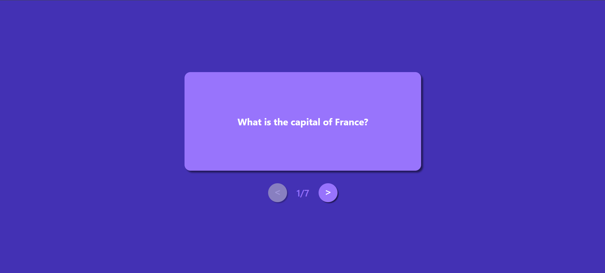

# 🃏 Flashcards App

A simple and interactive flashcards app built with React and Vite.  
Click the card to flip between the question and answer, and use the navigation buttons to move between cards.

---

## ✨ Features

- Flip cards to reveal answers  
- Navigate between flashcards with Previous/Next buttons  
- Responsive design for desktop and mobile  
- Smooth animations on buttons and card clicks  

---

## 📸 Preview




---

## 📦 Installation & Running Locally

1. **Clone the repository**
    ```
    git clone https://github.com/AryanPatel1918/flashcards-react-app.git
    cd flashcards-react-app
    ```

2. **Install dependencies**
    ```
    npm install
    ```

3. **Start the development server**
    ```
    npm run dev
    ```

4. **Open your browser and go to**
    ```
    http://localhost:5173
    ```